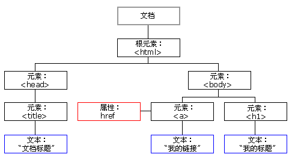

## 欢迎来到我的主页
该仓库主要是在学习 Web 编程过程中，在 Github 上创建属于自己的个人网站的记录。
主要记录的记录内容分别包括: HTML, CSS 和 JavaScript，最终的目标是想通过 Web 技术创建属于自己的个人博客，在里面记录工作、学习中涉及到的相关技术。
### HTML
#### 什么是 HTML?
HTML(HyperText Markup Language) 不是一门编程语言，而是一种用来告知浏览器如何组织页面的标记语言。HTML 可复杂、可简单，一切取决于开发者。它由一系列的元素(elements)组成，这些元素可以用来包围不同部分的内容，使其以某种方式呈现或者工作。 一对标签( tags)可以为一段文字或者一张图片添加超链接，将文字设置为斜体，改变字号，等等。
> 注: HTML 标签不区分大小写。也就是说，输入标签时既可以使用大写字母也可以使用小写字母。例如，标签 <title\> 写作 <title\>、<TITLE\>、<Title\>、<TiTlE\>，等等都可以正常工作。不过，从一致性和可读性来讲，最好仅使用小写字母。
#### 一个 HTML 元素包括什么？
1. 开始标签(Opening tag): 包含元素的名称，被左、右角括号所包围。表示元素从这里开始或者开始起作用。 
2. 结束标签(Closing tag): 与开始标签相似，只是其在元素名之前包含了一个斜杠。这表示着元素的结尾。初学者常常会犯忘记包含结束标签的错误，这可能会产生一些奇怪的结果。 
3. 内容(Content): 元素的内容，本例中就是所输入的文本本身。 
4. 元素(Element): 开始标签、结束标签与内容相结合，便是一个完整的元素。
例如，以下这个一个标签: 
```angular2html
<p>这是一个HTML的 p 标签元素</p>
```
#### HTML 基础教程
+ [HTML 简介](https: //www.w3school.com.cn/html/html_jianjie.asp)
+ [HTML 编辑器](https: //www.w3school.com.cn/html/html_editors.asp)
+ [基本的 HTML 标签](https: //www.w3school.com.cn/html/html_basic.asp)
+ [HTML 元素](https: //www.w3school.com.cn/html/html_elements.asp)
+ 
### CSS
### JavaScript
#### JavaScript 简单教程
+ [数组](https: //www.w3school.com.cn/js/js_arrays.asp)
  + [数组方法](https: //www.w3school.com.cn/js/js_array_methods.asp)
  + [JavaScript 数组排序](https: //www.w3school.com.cn/js/js_array_sort.asp)
  + [JavaScript 数组迭代](https: //www.w3school.com.cn/js/js_array_iteration.asp): 数组迭代方法对每个数组项进行操作。
    - `Array.forEach()`;
    - `Array.map()`;
    - `Array.filter()`;
    - `Array.reduce()`;
    - `Array.reduceRight()`;
    - `Array.every()`;
    - `Array.some()`;
    - `Array.indexOf()`;
    - `Array.lastIndexOf()`;
    - `Array.find()`;
    - `Array.findIndex()`
  + [JavaScript 数组 Const](https: //www.w3school.com.cn/js/js_array_const.asp)
+ [JavaScript 日期](https: //www.w3school.com.cn/js/js_dates.asp)
  + [JavaScript 日期格式](https: //www.w3school.com.cn/js/js_date_formats.asp)
  + [JavaScript 日期获取方法](https: //www.w3school.com.cn/js/js_date_methods.asp): 日期方法允许您获取并设置日期值(年、月、日、时、分、秒、毫秒)
    - `getTime()`;
    - `getFullYear()`;
    - `getHours()`;
    - `getMonth()`;
    - `getSeconds()`;
    - `getDate()`
  + [JavaScript 日期设置方法](https: //www.w3school.com.cn/js/js_date_methods_set.asp): 使用“设置日期”方法可以设置日期对象的日期值(年、月、日、小时、分钟、秒、毫秒)
    - `setTime()`;
    - `setSeconds()`;
    - `setMonth()`;
    - `setMinutes()`;
    - `setMilliseconds()`;
    - `setHours()`;
    - `setFullYear()`;
    - `setDate()`
+ [JavaScript 数学](https: //www.w3school.com.cn/js/js_math.asp): JavaScript `Math` 对象允许您对数字执行数学任务
  - `Math.PI`;
  - `Math.round()`;
  - `Math.pow()`;
  - `Math.sqrt()`;
  - `Math.abs()`;
  - `Math.ceil()`;
  - `Math.floor()`;
  - `Math.sin()`;
  - `Math.cos()`;
  - `Math.min()` 和 `Math.max()`;
  - `Math.random()`;
  - `Math.exp(x)`;
+ [JavaScript 随机](https: //www.w3school.com.cn/js/js_random.asp)
+ [JavaScript 逻辑](https: //www.w3school.com.cn/js/js_booleans.asp): JavaScript 布尔(逻辑)代表两个值之一: `true` 或 `false`
  + [JavaScript 比较](https: //www.w3school.com.cn/js/js_comparisons.asp): 比较和逻辑运算符用于测试 true 或 false
  + [JavaScript 条件](https: //www.w3school.com.cn/js/js_if_else.asp): 条件语句用于基于不同条件执行不同的动作
  + [JavaScript Switch 语句](https: //www.w3school.com.cn/js/js_switch.asp): `switch` 语句用于基于不同条件执行不同动作
+ [JavaScript For 循环](https: //www.w3school.com.cn/js/js_loop_for.asp): 循环可多次执行代码块
  - `for` 循环;
  - `for/in` 循环;
  - `while` 循环;
  - `do/while`;
+ [JavaScript `for in`](https: //www.w3school.com.cn/js/js_loop_forin.asp): JavaScript `for in` 语句循环遍历对象的属性
+ [JavaScript `for of`](https: //www.w3school.com.cn/js/js_loop_forof.asp): JavaScript `for of` 语句循环遍历可迭代对象的值
+ [JavaScript `while` 循环](https: //www.w3school.com.cn/js/js_loop_while.asp): 只要条件为 true，循环能够一直执行代码块
+ [JavaScript `break` 和 `continue`](https: //www.w3school.com.cn/js/js_break.asp): `break` 语句“跳出”循环，`continue` 语句“跳过”循环中的一个迭代
+ [JavaScript `typeof`](https: //www.w3school.com.cn/js/js_typeof.asp)
  - `typeof`
    - 5 种不同的可以包含值的数据类型:  `string`, `number`, `boolean`, `object`, `function` 
    - 6 种类型的对象:  `String`, `Data`, `Array`, `Object`, `Number`, `Boolean`
    - 2 种不能包含值的数据类型:  `null`, `undefined`
  - `constructor` 属性;
+ [JavaScript 类型转换](https: //www.w3school.com.cn/js/js_type_conversion.asp)
  - `Number()` 转换数值;
  - `String()` 转换字符串;
  - `Boolean()` 转换布尔值;
  - 自动类型转换: 如果 JavaScript 尝试操作一种“错误”的数据类型，它会试图将该值转换为“正确”的类型
  - 自动字符串转换: 当您试图“输出”对象或变量时，JavaScript 自动调用变量的 `toString()` 函数
+ [JavaScript 位运算符](https: //www.w3school.com.cn/js/js_bitwise.asp)
+ [JavaScript 正则表达式](https: //www.w3school.com.cn/js/js_regexp.asp): 正则表达式是构成搜索模式的字符序列，该搜索模式可用于文本搜索和文本替换操作
  - `search()`;
  - `replace()`;
  - `test()`;
  - `exec()`;
+ [JavaScript 错误 - Throw 和 Try to Catch](https: //www.w3school.com.cn/js/js_errors.asp)
  - `try` 语句使您能够测试代码块中的错误;
  - `catch` 语句允许您处理错误;
  - `throw` 语句允许您创建自定义错误;
  - `finally` 使您能够执行代码，在 `try` 和 `catch` 之后，无论结果如何;
  - `EvalError` ---> `SyntaxError`
  - `RangeError`;
  - `ReferenceError`;
  - `TypeError`;
  - `URIError`;
+ [JavaScript 作用域](https: //www.w3school.com.cn/js/js_scope.asp): 指的是您有权访问的变量集合，作用域决定了从代码不同部分对**变量**、**对象**和**函数**的可访问性。
  - 全局作用域: 全局作用域形成了完整的 JavaScript 环境，在 HTML 中，全局作用域是 window，所有全局变量均属于 window 对象;
  - 局部作用域;
  - JavaScript 函数作用域;
  - 自动全局: 如果您为**尚未声明**(未使用 `var`, `let`, `const` 关键字)的变量赋值，此变量会自动成为全局变量;
+ [JavaScript Hoisting](https: //www.w3school.com.cn/js/js_hoisting.asp): 提升(Hoisting)是 JavaScript 将声明移至顶部的默认行为
+ [JavaScript 严格模式](https: //www.w3school.com.cn/js/js_strict.asp): `use strict` 定义 JavaScript 代码应该以“严格模式”执行，例如: 在严格模式中，您无法使用未声明的变量
+ [JavaScript this 关键词](https: //www.w3school.com.cn/js/js_this.asp): JavaScript `this` 关键词指的是它所属的对象
  - 方法中的 `this`: 指的是此方法的“拥有者”;
  - 单独的 `this`: 全局对象，在浏览器窗口中，全局对象是 `[object Window]`;
  - 函数中的 `this`(默认): 指的是全局对象 `[object Window]`;
  - 函数中的 `this`(严格模式): 是未定义的(`undefined`);
  - 事件处理程序中的 `this`: 在 HTML 事件处理程序中，`this` 指的是接收此事件的 HTML 元素;
  - 对象方法绑定;
  - 显式函数绑定;
+ [JavaScript 箭头函数](https: //www.w3school.com.cn/js/js_arrow_function.asp)
+ [JavaScript 类](https: //www.w3school.com.cn/js/js_classes.asp): JavaScript 类是 JavaScript 对象的模板
  - `constructor()`;
+ [JavaScript JSON(JavaScript Object Notation)](https: //www.w3school.com.cn/js/js_json.asp): JSON 是存储和传输数据的格式，经常在数据从服务器发送到网页时使用
  - JSON 语法规则;
+ [JavaScript 调试](https: //www.w3school.com.cn/js/js_debugging.asp)
+ [JavaScript 样式指南](https: //www.w3school.com.cn/js/js_conventions.asp)
  - 变量名;
  - 运算符周围的空格;
  - 代码缩进;
  - 语句规则;
  - 对象规则;
  - 行长度小于 80;
  - 命名约定;
  - 在 HTML 中加载 JavaScript;
  - 使用小写文件名;
+ [JavaScript 常见错误](https: //www.w3school.com.cn/js/js_mistakes.asp)
  - 意外使用赋值运算符;
  - 期望松散的比较: 有一个常见的错误是忘记在 switch 语句中使用严格比较;
  - 令人困惑的加法和级联;
  - 令人误解的浮点;
  - 对 JavaScript 字符串换行;
  - 错位的分号;
  - 对 return 语句进行换行;
  - `undefined` 不是 `null`;
+ [JavaScript 性能](https: //www.w3school.com.cn/js/js_performance.asp)
  - 减少循环中的活动;
  - 减少 DOM 访问;
  - 缩减 DOM 规模;
  - 避免不必要的变量;
  - 延迟 JavaScript 加载: 请把脚本放在页面底部，使浏览器首先加载页面;
  - 避免使用 with;
+ [JavaScript 保留字](https: //www.w3school.com.cn/js/js_reserved.asp)
#### [JavaScript 版本](https: //www.w3school.com.cn/js/js_versions.asp)
+ [JavaScript ES5](https: //www.w3school.com.cn/js/js_es5.asp)
+ [JavaScript ES6](https: //www.w3school.com.cn/js/js_es6.asp)
+ [JavaScript 历史](https: //www.w3school.com.cn/js/js_history.asp)
#### JavaScript 对象
+ [JavaScript 对象定义](https: //www.w3school.com.cn/js/js_object_definition.asp)
  - JavaScript 原始值:  string, number, boolean, null, undefined;
  - 对象是包含变量的变量: **名称 :  值**对的形式编写;
  - 对象属性: JavaScript 对象中的命名值，被称为属性;
  - 对象方法: 方法是可以在对象上执行的动作;
  - 创建 JavaScript 对象
    - 使用对象字面量;
    - 使用 JavaScript 关键词 `new`: 出于简易性、可读性和执行速度的考虑，请使用第一种创建方法(对象文字方法);
  - JavaScript 对象是易变的: 它们通过**引用**来寻址，而非值;
+ [JavaScript 对象属性](https: //www.w3school.com.cn/js/js_object_properties.asp)
  - 访问 JavaScript 属性;
  - JavaScript `for...in` 循环;
  - 添加新属性;
  - 删除属性;
+ [JavaScript 对象方法](https: //www.w3school.com.cn/js/js_object_methods.asp): 方法是存储为对象属性的函数。
  - 访问对象方法;
  - 使用内建方法;
  - 添加新的方法: 向对象添加方法是在构造器函数内部完成的;
+ [JavaScript 显示对象](https: //www.w3school.com.cn/js/js_object_display.asp)
  - 使用 `Object.values()`;
  - 使用 `JSON.stringify()`;
+ [JavaScript 对象访问器](https: //www.w3school.com.cn/js/js_object_accessors.asp)
+ [JavaScript 对象构造器](https: //www.w3school.com.cn/js/js_object_constructors.asp)
  - 对象类型(蓝图)(类): 用大写首字母对构造器函数命名是个好习惯;
+ [JavaScript 对象原型](https: //www.w3school.com.cn/js/js_object_prototypes.asp): 所有 JavaScript 对象都从原型继承属性和方法
  - 原型继承: 日期对象继承自 `Date.prototype`,数组对象继承自 `Array.prototype`,`Object.prototype` 位于原型继承链的顶端;
  - 使用 prototype 属性;
+ [JavaScript ES5 对象方法](https: //www.w3school.com.cn/js/js_object_es5.asp)
  - 管理对象;
  - 保护对象;
  - 更改属性值;
  - 更改元数据;
  - 列出可枚举的属性;
  - 添加属性;
  - 添加 Getter 和 Setter;
+ [JavaScript `Map` 对象](https: //www.w3school.com.cn/js/js_object_maps.asp)
+ [JavaScript `Set` 对象](https: //www.w3school.com.cn/js/js_object_sets.asp)
#### JavaScript 函数
+ [JavaScript 函数定义](https: //www.w3school.com.cn/js/js_function_definition.asp)
  - 函数声明;
  - 函数表达式;
  - Function() 构造器;
  - 函数提升;
  - 自调用函数;
  - 函数是对象;
+ [JavaScript 函数参数](https: //www.w3school.com.cn/js/js_function_parameters.asp): JavaScript 函数不会对参数值进行任何检查
  - `arguments` 对象:  JavaScript 函数有一个名为 arguments 对象的内置对象;
  - 参数通过值传递;
  - 对象是由引用传递的;
+ [JavaScript 函数调用](https: //www.w3school.com.cn/js/js_function_invocation.asp): JavaScript 函数内部的代码会在“某物”调用它时执行
  - 以函数形式调用函数;
  - this 关键词;
  - 作为方法来调用函数;
  - 通过函数构造器来调用函数: 如果函数调用的前面是 `new` 关键字，那么这是一个构造函数调用;
+ [JavaScript 函数 `call`](https://www.w3school.com.cn/js/js_function_call.asp): 使用 `call()` 方法，您可以编写能够在不同对象上使用的方法
  - JavaScript `call()` 方法: 它可以用来调用所有者对象作为参数的方法, 通过 `call()`，您能够使用属于另一个对象的方法;
  - 带参数的 `call()` 方法;
+ [JavaScript 函数 `apply`](https://www.w3school.com.cn/js/js_function_apply.asp): 通过 apply() 方法，您能够编写用于不同对象的方法
+ [JavaScript 闭包](https://www.w3school.com.cn/js/js_function_closures.asp): 全局变量能够通过闭包实现局部(私有)
#### JavaScript 类
+ [JavaScript 类的简介](https://www.w3school.com.cn/js/js_class_intro.asp)
  - JavaScript 类的语法;
+ [JavaScript 类继承](https://www.w3school.com.cn/js/js_class_inheritance.asp)
+ [JavaScript Static 方法](https://www.w3school.com.cn/js/js_class_static.asp)
#### JavaScript Async
+ [JavaScript 回调](https://www.w3school.com.cn/js/js_callback.asp)
+ [异步的 JavaScript](https://www.w3school.com.cn/js/js_asynchronous.asp)
+ [JavaScript `Promise`](https://www.w3school.com.cn/js/js_promise.asp)
  - JavaScript `Promise` 对象;
+ [JavaScript Async](https://www.w3school.com.cn/js/js_async.asp)
#### JavaScript HTML DOM
+ [DOM(**D**ocument **O**bject **M**odel, 文档对象模型)简介](https://www.w3school.com.cn/js/js_htmldom.asp): 通过 HTML DOM，JavaScript 能够访问和改变 HTML 文档的所有元素, HTML DOM 是关于如何获取、更改、添加或删除 HTML 元素的标准。
  - HTML DOM 树;
    
  - JavaScript 能改变页面中的所有 HTML 元素;
  - JavaScript 能改变页面中的所有 HTML 属性;
  - JavaScript 能改变页面中的所有 CSS 样式;
  - JavaScript 能删除已有的 HTML 元素和属性;
  - JavaScript 能添加新的 HTML 元素和属性;
  - JavaScript 能对页面中所有已有的 HTML 事件作出反应;
  - JavaScript 能在页面中创建新的 HTML 事件;
+ [JavaScript - HTML DOM 方法](https://www.w3school.com.cn/js/js_htmldom_methods.asp): HTML DOM 方法是您能够(在 HTML 元素上)执行的动作, HTML DOM 属性是您能够设置或改变的 HTML 元素的值
+ [JavaScript HTML DOM 文档](https://www.w3school.com.cn/js/js_htmldom_document.asp): HTML DOM 文档对象是您的网页中所有其他对象的拥有者
  - 查找 HTML 元素;
  - 改变 HTML 元素;
  - 添加事件处理程序;
  - 查找 HTML 对象;
+ [JavaScript HTML DOM 元素](https://www.w3school.com.cn/js/js_htmldom_elements.asp): 查找和访问 HTML 页面中的 HTML 元素
  - 通过 `id` 查找 HTML 元素;
  - 通过标签名查找 HTML 元素;
  - 通过类名查找 HTML 元素;
  - 通过 CSS 选择器查找 HTML 元素;
  - 通过 HTML 对象选择器查找 HTML 对象: `document.forms`, `document.images`, `document.links`, ...
+ [JavaScript HTML DOM - 改变 HTML](https://www.w3school.com.cn/js/js_htmldom_html.asp)
+ [JavaScript 表单](https://www.w3school.com.cn/js/js_validation.asp)
  - JavaScript 表单验证;
  - JavaScript 可以验证数字输入;
  - 自动 HTML 表单验证;
  - 数据验证;
  - HTML 约束验证;
+ [JavaScript HTML DOM - 改变 CSS](https://www.w3school.com.cn/js/js_htmldom_css.asp): HTML DOM 允许 JavaScript 更改 HTML 元素的样式
+ [JavaScript HTML DOM 动画](https://www.w3school.com.cn/js/js_htmldom_animate.asp): 使用 JavaScript 来创建 HTML 动画
+ [JavaScript HTML DOM 事件](https://www.w3school.com.cn/js/js_htmldom_events.asp): HTML DOM 允许 JavaScript 对 HTML 事件作出反应
  - 对事件作出反应;
  - HTML 事件属性;
  - `onload` 和 `onunload` 事件;
  - `onchange` 事件;
  - `onmouseover` 和 `onmouseout` 事件;
  - `onmousedown`, `onmouseup` 以及 `onclick` 事件;
+ [JavaScript HTML DOM 事件监听程序](https://www.w3school.com.cn/js/js_htmldom_eventlistener.asp)
  - `addEventListener()` 方法;
  - 向元素添加事件处理程序;
  - 向相同元素添加多个事件处理程序;
  - 向 `window` 对象添加事件处理程序;
  - 事件冒泡还是事件捕获?
  - `removeEventListener()` 方法;
+ [JavaScript HTML DOM 导航](https://www.w3school.com.cn/js/js_htmldom_navigation.asp): 通过 HTML DOM，您能够使用节点关系来导航节点树
  - DOM 节点;
  - 节点关系;
  - 在节点之间导航: `parentNode`, `childNodes[nodenumber]`, `firstChild`, `lastChild`, `nextSibling`, `previousSibling`;
  - DOM 根节点: `document.body `, `document.documentElement`;
  - `nodeName` 属性;
  - `nodeValue` 属性;
  - `nodeType` 属性;
+ [JavaScript HTML DOM 元素(节点)](https://www.w3school.com.cn/js/js_htmldom_nodes.asp): 添加和删除节点(HTML 元素)
  - 创建新 HTML 元素(节点);
  - 创建新 HTML 元素 - `insertBefore()`;
  - 删除已有 HTML 元素;
  - 删除子节点;
  - 替换 HTML 元素: `replaceChild()`;
+ [JavaScript HTML DOM 集合](https://www.w3school.com.cn/js/js_htmldom_collections.asp)
  - HTMLCollection 对象: `getElementsByTagName()` 方法返回 HTMLCollection 对象, HTMLCollection 并非数组;
+ [JavaScript HTML DOM 节点列表](https://www.w3school.com.cn/js/js_htmldom_nodelist.asp)
  - HTML DOM NodeList 对象: NodeList 对象是从文档中提取的节点列表(集合);
#### JS Browser BOM(**B**rowser **O**bject **M**odel): 允许 JavaScript 与浏览器对话
+ [JavaScript `window` - 浏览器对象模型](https://www.w3school.com.cn/js/js_window.asp)
  - `window` 对象: 全局变量是 `window` 对象的属性, 全局函数是 `window` 对象的方法,甚至（HTML DOM 的）`document` 对象也是 `window` 对象属性;
  - 窗口尺寸;
  - 其他窗口方法: `window.open()`, `window.close()`, `window.moveTo()`, `window.resizeTo()`;
+ [JavaScript Window Screen](https://www.w3school.com.cn/js/js_window_screen.asp): `window.screen` 对象包含用户屏幕的信息
+ [JavaScript Window Location](https://www.w3school.com.cn/js/js_window_location.asp): `window.location` 对象可用于获取当前页面地址（URL）并把浏览器重定向到新页面
+ [JavaScript Window History](https://www.w3school.com.cn/js/js_window_history.asp): `window.history` 对象包含浏览器历史
+ [JavaScript Window Navigator](https://www.w3school.com.cn/js/js_window_navigator.asp): `window.navigator` 对象包含有关访问者的信息
+ [JavaScript 弹出框](https://www.w3school.com.cn/js/js_popup.asp): JavaScript 有三种类型的弹出框：警告框、确认框和提示框
+ [JavaScript Timing 事件](https://www.w3school.com.cn/js/js_timing.asp): JavaScript 可以在时间间隔内执行
  - Timing 事件: `setTimeout()` 方法, `clearTimeout()` 方法, `setInterval()` 方法, `clearInterval()` 方法
+ [JavaScript Cookies](https://www.w3school.com.cn/js/js_cookies.asp): Cookie 让您在网页中存储用户信息
#### JavaScript Web API
+ [Web API - 简介](https://www.w3school.com.cn/js/js_api_intro.asp): 扩展浏览器的功能, 极大简化复杂的功能, 为复杂的代码提供简单的语法
+ [JavaScript 验证 API](https://www.w3school.com.cn/js/js_validation_api.asp)
  - 约束验证 DOM 方法;
  - 约束验证 DOM 属性;
  - 有效性属性;
+ [Web History API](https://www.w3school.com.cn/js/js_api_history.asp)
+ [Web Storage API](https://www.w3school.com.cn/js/js_api_web_storage.asp)
  - `localStorage` 对象;
  - `sessionStorage` 对象;
+ [Web Worker API](https://www.w3school.com.cn/js/js_api_web_workers.asp): Web Worker 是在后台运行的 JavaScript，不会影响页面的性能
+ [JavaScript Fetch API](https://www.w3school.com.cn/js/js_api_fetch.asp): Fetch API 接口允许 Web 浏览器向 Web 服务器发出 HTTP 请求, 不再需要 XMLHttpRequest
+ [Web Geolocation API](https://www.w3school.com.cn/js/js_api_geolocation.asp)
#### JavaScript AJAX(**A**synchronous **J**avaScript **A**nd **X**ML)
+ [AJAX 简介](https://www.w3school.com.cn/js/js_ajax_intro.asp)
+ [AJAX - `XMLHttpRequest` 对象](https://www.w3school.com.cn/js/js_ajax_http.asp)
  - 创建 `XMLHttpRequest` 对象;
  - `XMLHttpRequest` 对象方法;
  - `XMLHttpRequest` 对象属性;
+ [AJAX 请求](https://www.w3school.com.cn/js/js_ajax_http_send.asp)
+ [AJAX - 服务器响应](https://www.w3school.com.cn/js/js_ajax_http_response.asp)
#### JavaScript 的重要总结
+ 所有 JavaScript 对象都拥有 `toString()` 方法;
+ `sort()` 方法是最强大的数组方法之一，默认地，`sort()` 函数按照字符串顺序对值进行排序，对于数值排序，需要加上一个**比值函数**，按照**比值函数**的结果对数组进行特定排序;
+ JavaScript 不提供查找数组中最大或最小数组值的内建函数。不过，在对数组进行排序之后，您能够使用索引来获得最高或最低值，仅仅需要找到最高或最低值，对整个数组进行排序是效率极低的方法。
+ 您可以使用 `Math.max.apply` 来查找数组中的最高值，可以使用 `Math.min.apply` 来查找数组中的最低值，当然，你可以定义自己的查找最大、最小值函数;
+ 所有具有“真实”值的即为 `True`，所有不具有“真实”值的即为 `false`;
+ 不要创建布尔对象。它会拖慢执行速度。 `new` 关键词会使代码复杂化，并产生某些意想不到的结果。当使用 `==` 运算符时，相等的布尔是相等的，当使用 `===` 运算符时，相等的布尔是不相等的，因为 `===` 运算符需要在类型和值两方面同时相等。
+ 比较两个 JavaScript 对象将始终返回 `false`，JavaScript 对象无法进行比较;
+ `switch case` 使用严格比较(===):  值必须与要匹配的类型相同，只有操作数属于同一类型时，严格比较才能为 true;
+ 您可以检查 `constructor` 属性以确定对象是否为数组(包含 "`Array`" 一词);
+ 使用 `null` 来清除对象，使用 `undefined` 来清除原始值;
+ 为了避免 bug，请始终在每个作用域的开头声明所有变量;
+ JavaScript 类中，请始终添加 constructor() 方法;
+ 请避免**全局变量**、`new`、`===`、`eval()`(`eval()` 函数用于将文本作为代码来允许)，意识到自动类型转换，用 default 来结束 switch;
+ JavaScript 变量不是**易变**的。只有 JavaScript 对象如此;
+ 请使用对象字面量 `{}` 代替 `new Object()`;
+ 请使用字符串字面量 `""` 代替 `new String()`;
+ 请使用数值字面量代替 `new Number()`;
+ 请使用布尔字面量代替 `new Boolean()`;
+ 请使用数组字面量 `[]` 代替 `new Array()`;
+ 请使用模式字面量代替 `new RexExp()`;
+ 请使用函数表达式 `() {}` 代替 `new Function()`;
+ 大多数情况下，您可以避免在 JavaScript 中使用 new 关键词;
+ JavaScript 函数参数规则: 1、JavaScript 函数定义不会为参数(`parameter`)规定数据类型;2、JavaScript 函数不会对所传递的参数(`argument`)实行类型检查;3、JavaScript 函数不会检查所接收参数(argument)的数量;
+ 不通过关键词 var 创建的变量总是全局的，即使它们在函数中创建;
+ 类中的语法必须以“严格模式”编写, 如果您不遵循“严格模式”规则，将收到错误消息;
+ static 类方法是在类本身上定义的, 您不能在对象上调用 `static` 方法，只能在对象类上调用;
+ 当网页被加载时，浏览器会创建页面的`文档对象模型`(Document Object Model);
+ 